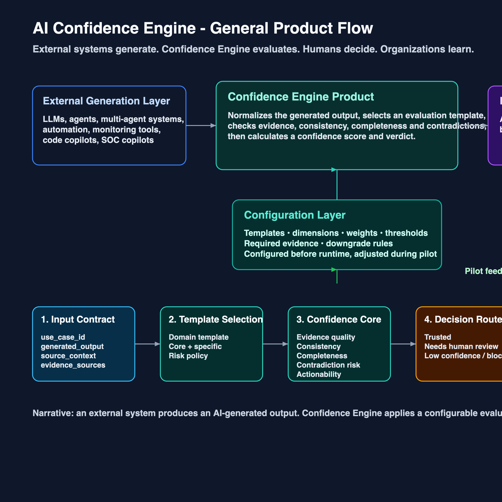
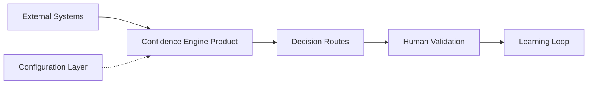

# AI Confidence Engine

> Configurable trust layer for AI-generated outputs

Public repo: [github.com/Riblo01/confidence-engine](https://github.com/Riblo01/confidence-engine)

## What This Project Is

AI Confidence Engine evaluates AI-generated outputs before people act on them.

It does not generate the output. It receives an already-generated RCA, code suggestion, support reply, security analysis, compliance review, or multi-agent result and decides whether it should be trusted, reviewed, or blocked.

The current product narrative is:

External systems generate. Confidence Engine evaluates. Humans decide. Organizations learn.

## Current Product Scope

The app is organized into two main views:

- `Mission Control`: interactive step-by-step confidence pipeline
- `Platform Explorer`: product walkthrough for the trust layer

The current experience covers:

- product flow from input to learning
- confidence evaluation with evidence and risk checks
- configuration studio for templates, dimensions, weights, thresholds, and rules
- learning and governance for feedback, auditability, and calibration
- mission control for scenario-based decision routes
- Kubernetes RCA deep dive as the technical proof case

## Visual Overview





The diagram above shows the main presentation flow. The configuration layer stays separate because it defines the trust model before runtime, while the main path shows how a generated output becomes a governed decision.

## Docs

- [Docs index](docs/README.md)
- [Main flow diagram](docs/visuals/ai-confidence-engine-main-flow.excalidraw)
- [Main flow PNG](docs/visuals/ai-confidence-engine-main-flow.png)
- [Kubernetes RCA prompt](docs/prompts/kubernetes-sre-rca-analysis.md)

## Demo Structure

### Mission Control

The interactive pipeline for a selected AI-generated output. It shows:

- scenario intake
- step-by-step evaluation
- evidence and risk progression
- trust decision
- feedback and memory update

### Platform Explorer

The higher-level product story. It shows:

- the product flow
- confidence evaluation
- configuration studio
- learning and governance
- use cases and deep dive

### Kubernetes Deep Dive

The operational proof case. It demonstrates the product on incident RCA data with:

- logs
- metrics
- traces
- Kubernetes events
- evidence correlation
- trust decision output

## Tech Stack

| Layer | Technology |
|---|---|
| UI | React 18 + TypeScript |
| Build | Vite 5 |
| Styling | CSS + Tailwind utilities |
| Icons | Lucide React |
| State | Local component state |
| Backend | None |

## Run Locally

```bash
cd ~/confidence-engine
npm install
npm run dev
```

Open the local app at `http://localhost:5173` or the port Vite assigns.

Build for production:

```bash
npm run build
npm run preview
```

## Scope Notes

- all data is synthetic and local
- no external APIs are required for the demo
- the project is designed for product demo and hackathon presentation
- the repository is public for sharing and review

## License

MIT for demo use.
